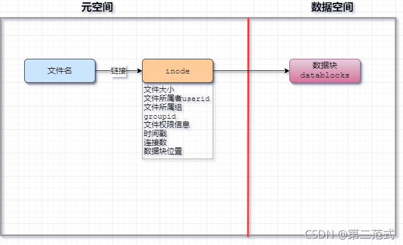
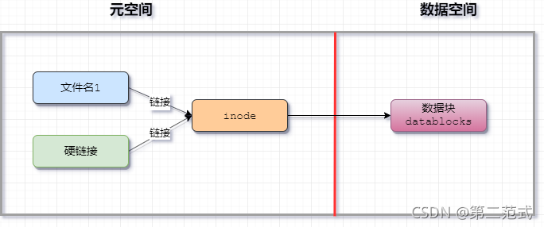
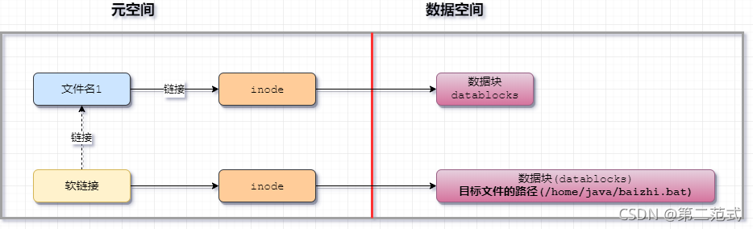
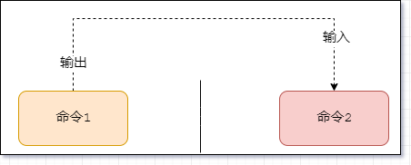
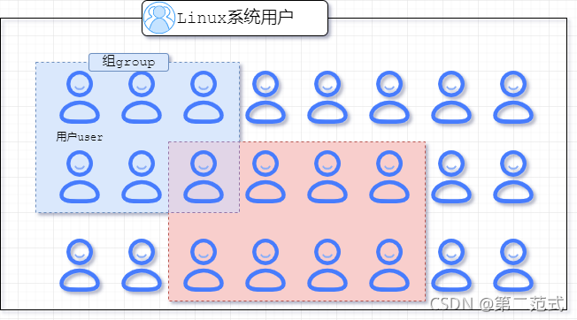
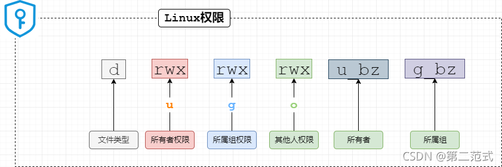

Linux命令大全(超详细版)
#### 1.简单系统命令
```sh
# 查看ip地址
	ip a
	ip addr
# ping网络(测试网络连通)
	ip 目标机器的ip
# 查看系统时间
	date
# 注销
	logout
# 关机
	shutdown now
# 重启
	reboot
# 清屏
	clear
```

#### 2.Linux文件系统
* 核心
```sh
1.Linux一切皆文件
2.只有一个顶级目录，不像windows分C盘、D盘、E盘
```
* 目录结构


* 文件含义

| Linux | 含义                                                                                            | windows                                        |
|:-----:|:-----------------------------------------------------------------------------------------------:|:----------------------------------------------:|
| /bin  | 所有用户可用的基本命令存放的位置                                                                | windows没有固定的命令存放目录                  |
| /sbin | 需要管理员权限才能使用的命令                                                                    |                                                |
| /boot | linux系统启动的时候需要加载和使用的文件                                                         |                                                |
| /dev  | 外设连接linux后，对应的文件存放的位置                                                            | 类似Windows中的U盘，光盘的符号文件              |
| /etc  | 存放系统或者安装的程序的配置文件,注册服务等                                                     | 类似windows中的注册表                          |
| /home | 家目录，linux中每新建一个用户，会自动在home中为该用户分配一个文件夹                                 | 类似windows中的"我的文档"，每个用户有自己的目录 |
| /root | root账户的家目录，仅供root账户使用                                                               | 类似windows中的Administrator账户的"我的文档"   |
| /lib  | linux的命令和系统启动，需要使用一些公共的依赖，放在lib中，类似我们开发的代码执行需要引入的jdk的jar。 |                                                |
| /usr  | 很多系统软件的默认安装路径                                                                      | 类似windows中的C盘下的Program Files目录        |
| /var  | 系统和程序运行产生的日志文件和缓存文件放在这里                                                  |                                                |

#### 3. 文件管理命令
注意事项：命令区分大小写
```sh
# 1. 查看文件列表
	ls [-参数1参数2] [目标文件夹]
```
```sh
# 查看当前目录下的文件列表
	ls
# 查看指定目录下的文件
	ls /
# 查看详细信息，元数据信息(用户、组、大小、创建时间、权限信息、文件类型)
	ls -l
# 查看隐藏文件
	ls -a 
# 参数并用
	ls -la
```
```sh
# 2. 切换目录
	cd 目标文件夹
```
```sh
# 绝对路径切换
	cd 绝对路径
# 相对路径切换
	cd 相对路径
# 例子：切换到/etc/sysconfig/networks-scripts 目录下
```
```sh
# 3. 查看当前命令所在的目录
```
```sh
[root@centos7 network-scripts]# pwd
/etc/sysconfig/network-scripts
# 特殊目录符号
	~ 当前用户的home目录
	. 当前目录
	.. 上一级目录
```
```sh
# 4. 新建文件夹及文件
```
```sh
# 在当前位置新建文件夹
	mkdir 文件夹名
# 在指定目录位置，创建文件夹，并创建父文件夹
	mkdir -p /a/b/文件夹名
# 在当前目录下新建文件
	touch 文件名
```
```sh
# 5. 删除文件
```
```sh
# 删除文件
	rm 文件
# 删除文件夹
	rm -r 文件夹
# 强制删除不询问
	rm -rf 文件
```
```sh
# 6. 拷贝文件
```
```sh
# 拷贝文件
	cp 原文件  新文件
# 拷贝文件夹
	cp -r 源文件夹 新文件夹
```
```sh
# 7. 移动文件或修改文件名
```
```sh
# 移动源文件到目标文件夹中
	mv 文件  文件夹
# 修改文件A的名字为文件B
	mv 文件A 文件B
```
```sh
# 8. 获取文件的md5指纹(数字签名)
```
```sh
md5sum 文件名
# 简介
1. 数字签名，又称数字指纹
2. 可以验证文件是否被修改
3. 一个文件通过计算得到的一串字符串,文件内容的唯一标记(文件内容不变,指纹不会变)
```

#### 4. 文本内容查看命令
```sh
# cat命令
```
```sh
# 查看文件中的全部信息(适合查看小文档)
	cat 文件名
```
```sh
# less命令
```
```sh
# 以分页的方式浏览文件信息(适合查看大文档)，进入浏览模式
	less 文件名
# 浏览模式快捷键
	↑ #上一行
    ↓ #下一行
    G #最后一页
    g #第一页
    空格 #下一页
    /关键词 #搜索关键词
# 退出浏览模式，回到Linux命令行模式
    q #退出
```
```sh
# tail 命令
```
```sh
# 实时滚动显示文件的最后10行信息(默认10行)
tail -f 文件名
# 显示文件的最后20行信息
tail -n 20 文件名
tail -n -20 文件名
# 显示文件信息从第20行至文件末尾
tail -n +20 文件名
```

#### 5. 文件查找
1. 文件名查找
```sh
# 语法
	find 搜索路径 -name "文件名关键词"
# 例子
	find / -name "passwd"
	find / -name "ifcfg-*"
```

2. 文件内容查找
```sh
# 语法
	grep -参数 要查找的目录范围
	# 参数
	-n 显示查找结果所在行号
	-R 递归查找目录下的所有文件
# 例子
	grep aries /etc
	grep aries /etc/passwd
```

#### 6. 文件链接
1. Linux文件管理
* 模型图



* 说明
```sh
# 文件名
	该文件的名字
# inode
	该文件的元数据
# datablock
	该文件真正保存的数据
```
```
注意：

1、inode中保存的是文件的元数据

2、ls命令查看的都是linux的元数据信息

3、数据块中才是文件的真正数据
```
2. 硬链接
* 图



* 命令
```sh
ln 源文件 硬链接文件
```
3. 软连接
* 图



* 命令
```sh
ln -s 目标文件或文件夹 软连接名字
```
#### 7. 系统管理
```sh
# 静态查看系统进程
	ps -aux
```
```sh
# 实时查看系统进程
	top
	# 快捷键
		↑ 下翻
		↓ 上翻
		q 退出
```
```sh
# 关闭进程
	kill 进程id 
# 强制关闭进程(谨慎使用)
	kill -9 进程id
```

#### 8. 输出
```sh
# 覆盖输出
```
```sh
# 将命令1的执行结果，输出到后面的文件中。
`覆盖写入`
	命令1 > 文件
# 例子
	date > date.log
```
```sh
# 追加输出
```
```sh
# 将命令1的执行结果，输出到后面的文件中。
`追加写入`
	命令1 >> 文件
# 例子
	date >> date.log
```

#### 9. 管道
```sh
# 管道
```
```sh
# 语法，将命令1的输出结果，作为命令2的输入
命令1 | 命令2
```


```sh
# 例子
查找aries用户：cat /etc/passwd | grep -n “baizhi”
查找aries组：cat /etc/group | grep -n “baizhi”
查找sshd进程：ps -aux | grep sshd
```

#### 10. 文件编辑
```
配置MobaXterm的默认文本编辑器
免去vim命令的麻烦
```
系统权限
****用户组****
* 图



* 相关命令
```sh
1. 创建组
  `groupadd 组名`
2. 删除组
  `groupdel 组名`
3. 查找系统中的组
  `cat /etc/group | grep -n “组名”`
  说明：系统每个组信息都会被存放在/etc/group的文件中
```

****用户****
* 相关命令
```sh
1. 创建用户
  `useradd -g 组名 用户名`
2. 设置密码
  `passwd 用户名`
3. 查找系统账户
  说明：系统每个用户信息保存在`/etc/passwd`文件中
4. 切换用户
  `su 用户名`
5. 删除用户
  `userdel -r 用户名`
```

****权限****
* 问题

linux系统未来可能有程序员、用户、数据库管理员、项目经理等各种角色各种级别人使用，甚至还有身份不明的人链接到linux，控制不好权限容易导致系统崩溃、数据丢失等问题。

* 权限含义

| 权限字母 | 含义 | 对文件                        | 代表命令                   | 对文件夹                 | 代表命令 |
|:--------:|:----:|:-----------------------------:|:--------------------------:|:------------------------:|:---------|
| R®       | 读   | 查看文件内容和复制文件        | more cat less cp head tail | 查看文件夹下的文件       | ls       |
| W(w)     | 写   | 编辑文件                      | vi                         | 在文件夹内创建和删除文件 | rm touch |
| X(x)     | 执行 | 执行该文件(执行必须具备r权限) | -                          | 切换到文件夹             | cd       |


* 权限访问控制列表(ACL access controll list)


* 命令
```sh
# 查看权限
```
```sh
ls -la 文件
ll 文件
```
```sh
# 设置文件所有者
```
```
语法：chown [-R] user名:group名 文件名
参数：-R 如果是文件夹，需要使用这个参数，可以将文件夹及其内部所有文件的所有者和组全部修改
注意：命令权限需要root
## 修改文件所有者
	chown 用户名 文件名
## 修改文件所属组
	chown :组名 文件名
## 修改文件所有者和所属组
	chown 用户名:组名 文件名
## 修改文件夹的所有者和所属组
	chown [-R] 用户名:组名 文件夹
```
```sh
# 权限设置1
```
```sh
语法：chmod u±rwx,g±rwx,o±rwx 文件名
运算符：
	- 删除权限
	+ 添加权限
	= 赋值权限
## 给文件的所有者添加执行权限
chmod u+x 文件名
## 给文件的其他人删除所有权限
chmod o-rwx 文件名
## 给文件的所属组设置读写权限
chmod g=wx 文件名
```
```sh
# 权限设置2
```


```sh
# 文件的每个归属方的权限的值使用rwx之和计算出来的。
# 语法
	`chmod [-R] nnn 文件` 
	-R 递归设置文件夹内所有文件
# 设置文件的权限为(所有者可读可写可执行，所属组可读可写，其他人可读)
	chmod 764 文件名
```

### 系统软件管理
#### 压缩解压缩
压缩语法：tar -zcvf 压缩后文件名 被压缩文件

解压缩语法 tar -zxvf 压缩文件名 -C 解压后文件所在目录

参数1：

		
	
	
	
	
| 参数 | 描述                             |
|:----:|:--------------------------------:|
| -z   | 操作tar.gz文件需要使用           |
| -x   | 解压缩                           |
| -c   | 压缩                             |
| -v   | 显示压缩或者解压缩的执行过程信息 |
| -f   | 要处理的文件file，必须放在最后    |


参数2：-C 指定解压后的文件存放的位置

#### rpm软件
```
简介：类似于windows中的.exe程序
```
```sh
1. 安装rpm软件
  语法：`rpm -ivh xxx.rpm`
2. 查看系统中是否已安装的过该rpm软件
  语法：`rpm -qa 软件名`
3. 卸载rpm软件
  语法：`rpm -e 软件名`
4. 例子：安装tree工具
  作用：查看某个目录下的文件信息
  # 以树状结构查看2层文件信息
  tree -L 2 要查看的路径
```

#### yum
```
yum基于rpm实现的，提供了除了rpm的安装软件、卸载软件等功能以外还有，自动查找、下载软件并自动处理软件的彼此之间的依赖关系，下载并安装依赖包。
```
```sh
## 列出所有可以安装的软件包
	yum list
## 安装软件
	yum install -y 软件名
## 卸载软件
	yum remove 软件名
## 查找软件包
	yum search all 软件名
```

#### Linux服务
```sh
# 例如：sshd network firewalld 等
```
```sh
# 服务器管理命令
	systemctl status 服务名
# 启动服务
	systemctl start 服务名
# 重启服务
	systemctl restart 服务名
# 停止服务
	systemctl stop 服务名
# 禁止服务随linux启动。
	systemctl disable 服务名
# 设置服务随linux启动。
	systemctl enable 服务名
```

#### ip设置
###### 服务名:network
```sh
[root@centos7 dirnew]# vim /etc/sysconfig/network-scripts/ifcfg-ens33
----------------网卡对应的文件内容---------------------
    TYPE="Ethernet"
    PROXY_METHOD="none"
    BROWSER_ONLY="no"
    BOOTPROTO="none"
    DEFROUTE="yes"
    IPV4_FAILURE_FATAL="no"
    IPV6INIT="yes"
    IPV6_AUTOCONF="yes"
    IPV6_DEFROUTE="yes"
    IPV6_FAILURE_FATAL="no"
    IPV6_ADDR_GEN_MODE="stable-privacy"
    NAME="ens33"
    UUID="0bd5d8a5-fe1b-42de-82bd-bfa7d2984b95"
    DEVICE="ens33"
    ONBOOT="yes"
    IPADDR="192.168.199.8" # 修改这里的ip地址即可
    PREFIX="24"
    GATEWAY="192.168.199.2"
    DNS1="192.168.199.2"
    DNS2="8.8.8.8"
    IPV6_PRIVACY="no"
[root@centos7 dirnew]# systemctl restart network #重启网卡服务
```

#### 防火墙
###### 服务名:firewalld
```sh
# 开启防火墙
systemctl start 服务名
# 关闭防火墙(服务器重启后还会自动开启防火墙)
systemctl stop firewalld
# 禁止防火墙开机启动
systemctl disable firewalld
```

#### 主机名
```sh
# 查看主机名
hostname
# 设置主机名
hostnamectl set-hostname 主机名
```

#### ip映射
* 域名解析

* 本地hosts编辑
```sh
[root@centos7 ~]# vim /etc/hosts
--------------下面是文件------------------
	192.168.199.8 centos7
```

#### SSH
```sh
# 远程登录linux
ssh 远程linux的ip或者映射域名
```

#### 免密登录
```sh
# 简介
ssh登录远程linux，免去输入密码的麻烦
```
```sh
# 生成公钥和私钥
[root@centos7 ~]# ssh-keygen
------------执行结果-----------
    [root@centos7 ~]# tree .ssh
    .ssh
    ├── id_rsa # 私钥
    ├── id_rsa.pub # 公钥
    └── known_hosts
# 发送公钥
	`保存公钥的文件为/root/.ssh/authorized_keys`
[root@centos7 .ssh]# cat id_rsa.pub > authorized_keys
# 发送公钥
[root@centos7 .ssh]# ssh-copy-id 目标主机的ip
```

#### 远程拷贝
```sh
scp 本地的文件 root@远程linuxip:/远程linux的文件路径
scp -r 本地的目录 root@远程linuxip:/远程linux的文件路径
```

#### 必要软件安装
1. vim(vi编辑器增强版)
```sh
vim 文件
```
2. wget(下载器)
```sh
wget url
```
3. tree(目录树状显示)
```sh
# 以tree结构，递归显示当前文件下所有文件
	tree
# 显示目标文件夹下的文件
	tree 目标目录
```

4. psmisc(高级进程管理工具)
```sh
# 以tree形式显示系统目前进程
	pstree
# 杀死进程
	killall 进程名
# 显示该文件被哪个进程使用
	fuser /目标文件
```

5. jdk安装
